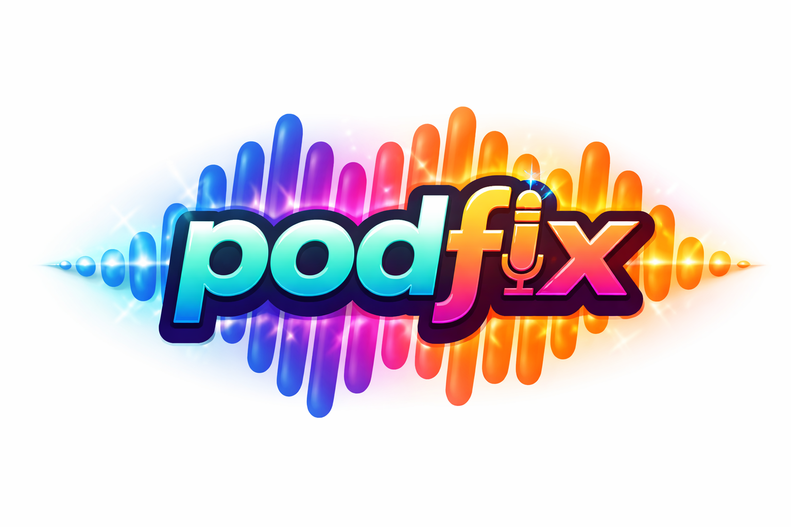

# Podfix

Are you tired of listening to podcasts WiTH voluME LEVELS ALl oVER tHe PLAce? Does your podcast contain thumping bass that shatters your car windows while you are trying to listen to an interesting interview? Is the podcast maybe video but you only want to listen to the audio in your car without distraction? Then you need `podfix`. 

`podfix` is a self-hosted podcast repair tool for people who are tired of amateur podcasts with muddy audio, uneven speaker volume, and constant reach-for-the-volume-button moments. It downloads episodes, removes video, cleans them up with `ffmpeg`, reduces size, and publishes replacement RSS feeds that point at the processed MP3 files for your listening pleasure.

For the full story behind this tool can be found in [this blogpost on www.rolfje.com](https://www.rolfje.com/2026/04/01/the-podcast-problem-fixed/).

## DISCLAIMER

This project is intended for personal, private use on your own machine or personal server.

Do not treat the generated feed or processed MP3 files as something you can publish publicly or redistribute to other people. If you run this tool, prefer a setup that is clearly private:

- host it only for yourself
- keep it behind authentication such as HTTP Basic Auth
- use an unlisted URL in addition to access control, not instead of it
- disable indexing and directory listing on the server

If you want multiple people to use processed feeds, get proper legal advice first. A hidden URL alone is not the same thing as a private personal-use setup.

See [Private nginx hosting](#private-nginx-hosting) below for an example setup with HTTP Basic Auth.

## Current functionality:

- Fetches and parses upstream RSS feeds
- Supports multiple podcasts from one TOML config file
- Keeps local state so unchanged episodes are skipped on normal sync runs
- Downloads audio or video enclosures
- Transcodes everything to MP3 with spoken-word defaults, compression, and optional loudness normalization
- Regenerates one output feed per configured podcast under a static `public/` directory
- Can cache and badge artwork locally with a blue `COMPRESSED` pill
- Preserves show artwork and per-episode artwork in the generated feed
- Generates a root landing page that lists all configured podcasts
- Provides `sync`, `refresh`, `rebuild`, and `serve` CLI commands

## Layout

The generated output tree looks like this:

```text
output/
  data/
    public/
      index.html
      media-change-me/
        dai-carter/
          episodes/
      dai-carter/
        index.html
        feed.xml
        images/
    state/
    cache/
    downloads/
```

Each configured podcast gets its own subdirectory under `public/`. The root `public/index.html` lists all shows and links to each feed page.

Only published MP3s are retained under `public/<media_path_token>/<slug>/episodes/` by default. If `keep_original_downloads = true`, the original source files are also kept under `downloads/<slug>/` for debugging.

Serve `output/data/public/` with any static web server, or use the built-in convenience command.

## Requirements

- Python 3.11+
- `ffmpeg` available on `PATH`, or point `ffmpeg.binary` at it in config

## Install

Run Podfix through the included shell script:

```bash
./podfix.sh --help
```

On first run, `podfix.sh` creates `.venv` if needed, installs the project into it, and then forwards all arguments to the Python CLI.

For scheduler use, the repository includes [run-sync.sh](./run-sync.sh), which calls `podfix.sh` with `config.server.toml` by default.

If you still have an older globally installed `podcast-proxy` command and want to remove it:

```bash
/Library/Frameworks/Python.framework/Versions/3.11/bin/python3.11 -m pip uninstall podcast-proxy
```

## Configuration

See [CONFIGURATION.md](./CONFIGURATION.md) for the full configuration reference.

Start from the included example files such as [config.local.example.toml](./config.local.example.toml) or [config.server.example.toml](./config.server.example.toml), then adjust:

```toml
base_url = "https://podfix.example.com"
output_dir = "./output"
keep_original_downloads = false
cache_artwork = false
badge_artwork = false
max_episodes = 20
podcast_mode = "auto"
media_path_token = "media-change-me"

[http]
basic_auth_username = "podfix"
basic_auth_password = "change-me"

[[podcasts]]
slug = "example-news"
upstream_feed_url = "https://example.com/podcast/feed.xml"

[[podcasts]]
slug = "example-story"
upstream_feed_url = "https://example.com/documentary/feed.xml"
podcast_mode = "story"
max_episodes = 12
keep_original_downloads = true
ffmpeg = { compressor_threshold_db = -24, compressor_ratio = "6", loudness_target_lufs = -14 }
```

You can also split config across files with `include`, which is useful for keeping shared podcast and `ffmpeg` settings in one file and machine-specific paths/URLs in another. Includes are resolved relative to the file that declares them.

Example shared config:

```toml
# config.shared.toml
keep_original_downloads = false
badge_artwork = true
max_episodes = 5
podcast_mode = "auto"

[[podcasts]]
slug = "example-news"
upstream_feed_url = "https://example.com/podcast/feed.xml"

[ffmpeg]
binary = "ffmpeg"
```

Example laptop or server-specific config:

```toml
# config.local.toml or config.server.toml
include = "config.shared.toml"

base_url = "https://podfix.example.com"
output_dir = "./output"
media_path_token = "media-change-me"

[http]
basic_auth_username = "podfix"
basic_auth_password = "change-me"
```

Merge behavior:

- included files are loaded first
- the current file overrides scalar values and tables from included files
- `[[podcasts]]` entries from included files are preserved and appended to any local `[[podcasts]]` entries

Recommended layout:

- commit `config.shared.toml` plus `config.local.example.toml` and `config.server.example.toml`
- keep real `config.local.toml` and `config.server.toml` untracked and machine-specific
- copy the example file that matches the machine and adjust only `base_url` and `output_dir`
- include paths can be a single string or a list of strings

Important config values:

- `base_url`: public base URL where podcast pages, feeds, and episodes will be served
- `output_dir`: root for generated data
- `include`: optional string or list of TOML files to merge before the current file
- `keep_original_downloads`: if `true`, keep the original downloaded source files for debugging
- `cache_artwork`: if `true`, artwork is cached locally without modification
- `badge_artwork`: if `true`, artwork is cached locally and stamped with a blue `COMPRESSED` badge
- `max_episodes`: default number of episodes to retain in each generated feed and show page; set `"unlimited"` to keep all synced episodes
- `podcast_mode`: default mode for podcasts that do not override it
- `media_path_token`: secret path segment used for public episode MP3 URLs; default is `media-change-me`, so set a hard-to-guess value in your real config
- `[http].basic_auth_username` and `[http].basic_auth_password`: credentials used by `podfix serve`; defaults are `podfix` / `change-me`, so change them in your real config
- `[[podcasts]]`: array of podcast entries in the same TOML file
- `slug`: URL path segment and output folder name for that podcast
- `upstream_feed_url`: source podcast feed for that podcast

Per-podcast overrides:

- Each `[[podcasts]]` entry can override `max_episodes`, `podcast_mode`, `cache_artwork`, `badge_artwork`, and `keep_original_downloads`.
- Each `[[podcasts]]` entry can also override audio processing with an inline `ffmpeg = { ... }` table. Only the keys you specify are changed for that show; the rest inherit from the top-level `[ffmpeg]` settings.

Example per-show `ffmpeg` override:

```toml
[[podcasts]]
slug = "quiet-interviews"
upstream_feed_url = "https://example.com/interviews/feed.xml"
podcast_mode = "story"
ffmpeg = { compressor_threshold_db = -24, compressor_ratio = "6", loudness_target_lufs = -14 }
```

Mode behavior:

- `news`: on each `sync`, process only the single newest upstream episode; generated feeds and show pages are ordered newest to oldest
- `story`: on each `sync`, process only the single oldest not-yet-synced episode; generated feeds and show pages are ordered oldest to newest
- `auto`: use RSS metadata when available; currently `itunes:type = serial` maps to `story`, otherwise it falls back to `news`
- `max_episodes` with `news`: keep the newest `N` synced episodes and prune anything older
- `max_episodes` with `story`: work only within the oldest `N` upstream episodes; newer episodes are ignored until you raise the limit or use `"unlimited"`
- `max_episodes = "unlimited"`: keep all synced episodes in the generated feed and show page, which is useful for documentaries and serialized archives

Audio tuning:

- `compressor_threshold_db`: lower values compress more of the signal
- `compressor_ratio`: higher values compress peaks harder
- `channels = 1`: mono output
- `channels = 2`: stereo output
- `normalize = true`: adds `loudnorm` after compression
- `loudness_target_lufs`, `true_peak_db`, `loudness_range_target`: loudness normalization targets

## Usage

Sync new items:

```bash
./podfix.sh sync --config config.toml
```

Sync only one show:

```bash
./podfix.sh sync --config config.toml --podcast dai-carter
```

Force a clean rebuild:

```bash
./podfix.sh rebuild --config config.toml
```

Rebuild only one show:

```bash
./podfix.sh rebuild --config config.toml --podcast dai-carter
```

`rebuild` force-overwrites existing public episode files and re-runs `ffmpeg`, so updated audio settings take effect even when filenames stay the same.

Refresh feed, site, artwork, and local URLs without reprocessing audio:

```bash
./podfix.sh refresh --config config.toml
```

Refresh one show only:

```bash
./podfix.sh refresh --config config.toml --podcast dai-carter
```

`refresh` re-fetches the selected feed window, refreshes show and episode artwork for already-synced episodes, rewrites the public feed and show pages, refreshes local enclosure URLs from the current config, and skips media download/transcode work.

`rebuild-images` still works as a deprecated alias for `refresh`.

Serve the generated feed locally:

```bash
./podfix.sh serve --config config.toml --port 8080
```

`podfix serve` keeps feeds and pages behind HTTP Basic Auth. If you do not set credentials in `[http]`, it falls back to `podfix` / `change-me`.

Episode MP3 URLs are exposed on a separate tokenized path based on `media_path_token`. The built-in server keeps feeds and pages behind Basic Auth, serves tokenized MP3 URLs without auth so podcast apps can fetch them directly, and adds `X-Robots-Tag: noindex, nofollow, noarchive, nosnippet` plus `Cache-Control: private` on those MP3 responses.

Then open:

```text
http://localhost:8080/
```

The root landing page lists all configured podcasts. Each show also gets its own page under:

```text
http://localhost:8080/<slug>/
```

For podcast apps, use:

```text
http://localhost:8080/<slug>/feed.xml
```

## Private nginx hosting

If you publish the generated files from nginx, keep the podcast area behind authentication so the setup stays personal/private. One simple way is to serve the generated files from a protected path such as `/private/`:

```nginx
server {
    listen 80;
    server_name localhost;

    root /usr/share/nginx/html;
    index index.html index.htm;

    # Tokenized MP3 files stay hard to guess, are not gzip-compressed,
    # and tell bots not to index or cache them.
    location ~* ^/private/media-change-me/.*\.mp3$ {
        auth_basic off;
        gzip off;
        add_header X-Robots-Tag "noindex, nofollow, noarchive, nosnippet" always;
        add_header Cache-Control "private" always;
        try_files $uri =404;
    }

    # Basic Authentication on anything below /private/
    location /private/ {
        auth_basic "Restricted";
        auth_basic_user_file /etc/nginx/.htpasswd;
        try_files $uri $uri/ =404;
    }

    # Do not serve hidden files (files starting with a .)
    location ~ /\. {
        deny all;
        return 404;
        access_log off;
        log_not_found off;
    }

    # Allow access to everything else (change this if needed)
    location / {
        aio off;
        directio off;
        try_files $uri $uri/ =404;
    }

    include /etc/nginx/includes/common-errors.inc;
}
```

With a setup like this, your `base_url` should point at the protected path, for example:

```toml
base_url = "https://example.com/private"
```

Apple Podcasts has been tested with HTTP Basic Auth in this kind of setup and works with protected feed URLs.

If you serve the generated files from nginx, keep a tokenized unauthenticated MP3 location under `/private/`, disable `gzip` there, and add `X-Robots-Tag` plus `Cache-Control` headers so podcast apps can stream the audio while bots are discouraged from indexing it. Keep the feed and pages themselves behind Basic Auth.

## Scheduling synchronization

For scheduled syncs, there is a script you can directly call from your `cron` schedule:

```bash
./run-sync.sh
```

`run-sync.sh` uses `config.server.toml` in the repo by default. Override it per machine if needed:

```bash
CONFIG_FILE=/path/to/config.server.toml ./run-sync.sh
```

## ffmpeg configuration details

In the `[ffmpeg]` config section in your config file you can change the way episodes are normalized:

Normalization notes:

- `normalize = true` enables a final `loudnorm` stage after compression
- `loudness_target_lufs = -16` is a reasonable spoken-word default
- `true_peak_db = -1.5` keeps peaks under control for MP3 output

## Notes

- `sync` processes at most one episode per podcast on each run.
- For `news` podcasts that one episode is the newest upstream item.
- For `story` podcasts that one episode is the oldest not-yet-synced item inside the configured episode window.
- For `news`, the episode window is the newest `max_episodes` items.
- For `story`, the episode window is the oldest `max_episodes` items.
- Use `max_episodes = "unlimited"` to let `story` feeds backfill the full archive.
- `rebuild` always re-fetches the selected episode window and re-encodes the output MP3s, per podcast.
- `refresh` always re-fetches the selected episode window, refreshes artwork and local URLs for already-synced episodes, and rewrites feed/site output without running `ffmpeg`.
- Failed episode downloads or transcodes are logged and skipped.
- The state file is written atomically to avoid partial corruption.
- Episode artwork can be reused from the upstream feed or cached locally with a badge, depending on config.
- This tool is intended for personal use and self-hosting.
